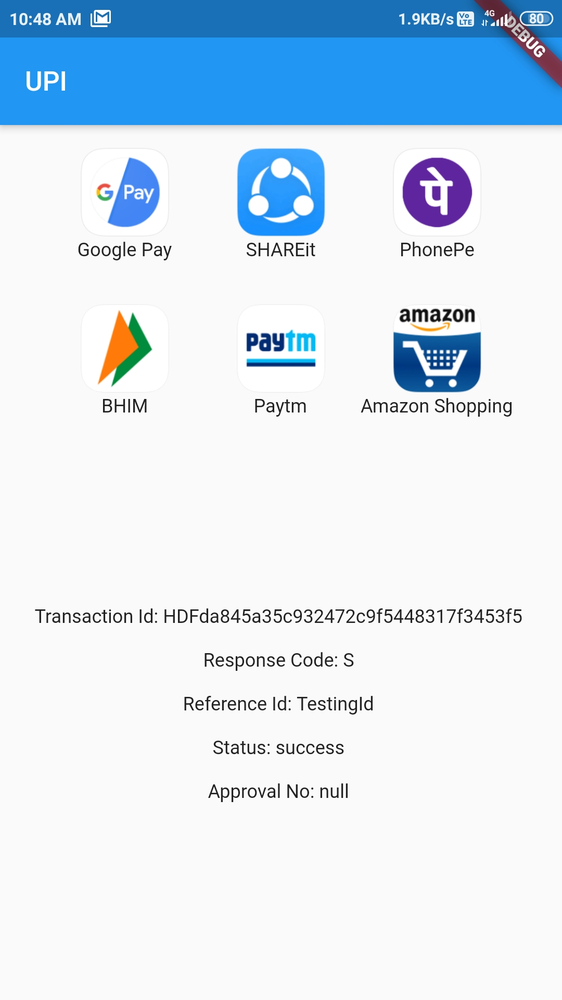

# UPI India (for Android only)

This plugin is used to integrate **UPI** Options in your **Android** app.

If you can help me to extend this for ios too, feel free to do a Pull Request.
Thanks in advance!

For a complete example of how to use this plugin, look at the **Example** tab or in the [Github repositiry](https://github.com/mdazharuddin1011999/UPI-Plugin-Flutter/blob/master/example/lib/main.dart).

***




## Classes to know
1. **UpiIndia** - It is the main class containing two methods:
getAllUpiApps(),  startTransaction()

2. **UpiApp** - It contains package name of some popular UPI apps. It is also the model class for the apps returned by getAllUpiApps() and now stores **app icons** too.

3. **UpiResponse** - You will use this to get response from the requested app.

4. **UpiStatus** - Use this to see if transaction was a success or not.

5. **UpiError** - This class contains some common errors which you may encounter.
***

## How to start transaction?

### Step 1:
Import the Package:

```dart
import 'package:upi_india/upi_india.dart';
```

### Step 2:
Create **UpiIndia** object.

```dart
UpiIndia _upiIndia = UpiIndia();
```

### Step 3:
Get list of all apps in the device which can handle UPI Intent, as shown.

```dart
List<UpiIndiaApp> apps;

@override
void initState() {
  _upiIndia.getAllUpiApps().then((value) {
    setState(() {
      apps = value;
    });
  });
  super.initState();
}
```

**OR**

You can use some of the predefined apps directly, like:

```dart
String app = UpiApp.GooglePay;
```

and assign it to the app parameter in **Step 4**

### Step 4:
Create a method which will start the transaction on being called, as shown.

```dart
Future<UpiResponse> initiateTransaction(String app) async {
  return _upiIndia.startTransaction(
    app: apps[0].app, //  I took only the first app from List<UpiIndiaApp> app.
    receiverUpiId: 'tester@test', // Make Sure to change this UPI Id
    receiverName: 'Tester',
    transactionRefId: 'TestingId',
    transactionNote: 'Not actual. Just an example.',
    amount: 1.00,
  );
}
```

### Step 5:
Call this method on any button click or through FutureBuilder and then you will get the Response!
***

## How to handle Response?

### Step 1:
After getting **UpiResponse**, check if its error property is **null** or not. If it is **not null**, handle it as shown:

```dart
if (_upiResponse.error != null) {
switch (_upiResponse.error) {
  case UpiError.APP_NOT_INSTALLED:
    print("Requested app not installed on device");
    break;
  case UpiError.INVALID_PARAMETERS:
    print("Requested app cannot handle the transaction");
    break;
  case UpiError.NULL_RESPONSE:
    print("requested app didn't returned any response");
    break;
  case UpiError.USER_CANCELLED:
    print("You cancelled the transaction");
    break;
}
```

### Step 2:
If **_upiResponse.error** is null, you can then get these parameters from it:
* Transaction ID
* Response Code
* Approval Reference Number
* Transaction Reference ID
* Status

### Step 3:
Check the Status property. It has following values:
* UpiStatus.SUCCESS
* UpiStatus.SUBMITTED
* UpiStatus.FAILURE

If Status is SUCCESS, Congratulations! You have successfully used this plugin.
***

Predefined apps in this plugin are:
* PayTM
* Google Pay
* BHIM
* PhonePe
* Amazon Pay
* Truecaller
* My Airtel
* Mobikwik
* FreeCharge
* SBIPay
* IMobileICICI

For a complete example of how to use this plugin, look at the **Example** tab or in the [Github repositiry](https://github.com/mdazharuddin1011999/UPI-Plugin-Flutter/blob/master/example/lib/main.dart).

Don't forget to give Like and Stars!